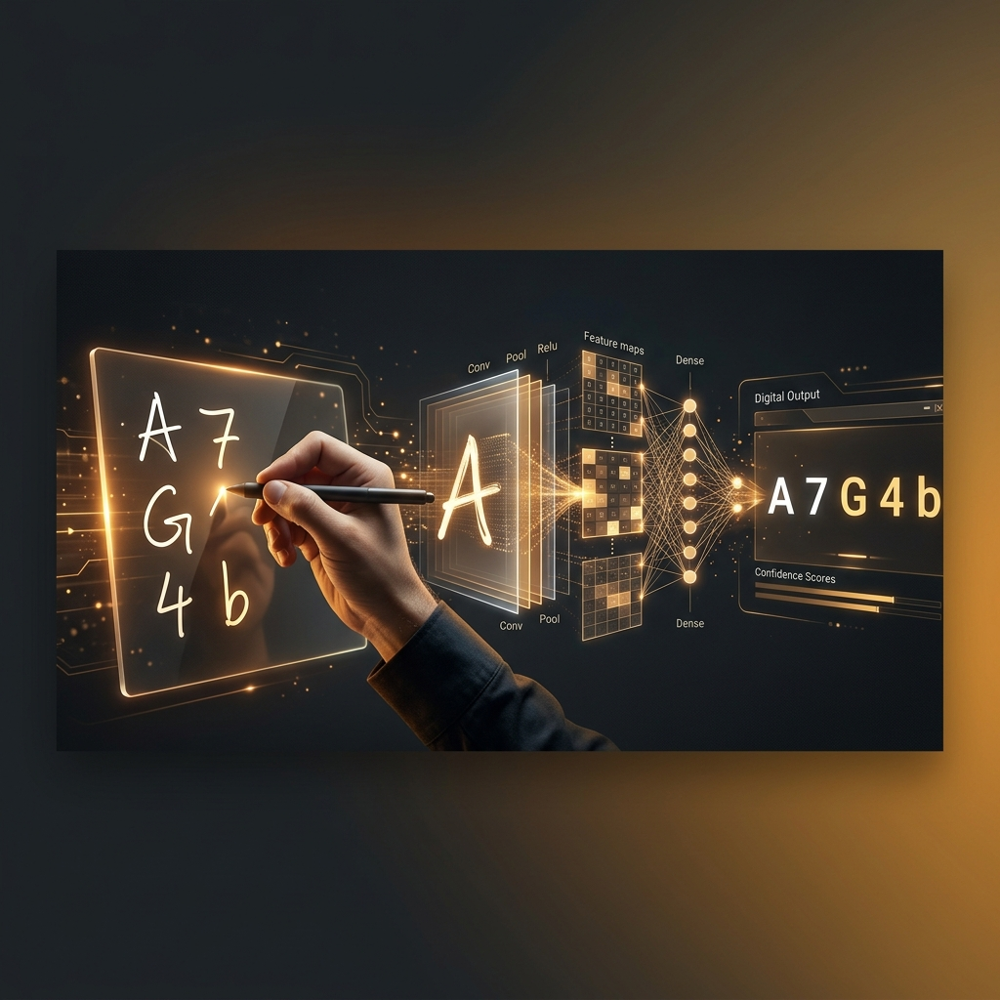

# Handwritten AlphaNumeric Recognizer Using CNN

<p align="center">
  
</p>

## Overview

An end-to-end deep learning web application that recognizes **hand-drawn letters and numbers** in real-time. Users draw characters directly on an interactive HTML5 canvas, and a **Convolutional Neural Network (CNN)** trained on the EMNIST dataset instantly identifies the character — complete with sound effects for an engaging experience.

---

## Live Demo

🔗 **Try it out:** [Streamlit App](https://srivatsacool-handwritten-alphanumeric-recognizer-app-rxkfhz.streamlit.app/)

---

## Key Features

- **Draw & Recognize** — Freehand canvas for drawing any letter (A–Z) or digit (0–9)
- **CNN-powered** — Convolutional Neural Network trained on EMNIST for high accuracy
- **Sound Effects** — Audio feedback on successful recognition
- **Real-time inference** — Instant predictions as you draw
- **Interactive UI** — Clean, intuitive Streamlit interface

---

## Technology Stack

| Technology | Purpose |
|---|---|
| Python 3 | Core language |
| TensorFlow / Keras | CNN model training and inference |
| OpenCV | Image preprocessing |
| NumPy | Array operations |
| Streamlit | Web application interface |
| streamlit-drawable-canvas | Interactive drawing canvas |

---

## How It Works

```text
User Draws on Canvas
        ↓
Image Capture & Preprocessing
        ↓
Resize to 28×28 grayscale
        ↓
CNN Model Inference
        ↓
Character Prediction + Sound Effect
```

---

## Installation & Setup

```bash
git clone https://github.com/srivatsacool/Handwritten_AlphaNumeric_Recognizer_using_CNN
cd Handwritten_AlphaNumeric_Recognizer_using_CNN
pip install -r requirements.txt
streamlit run app.py
```

---

## Author

**Srivatsa Gorti**

---
